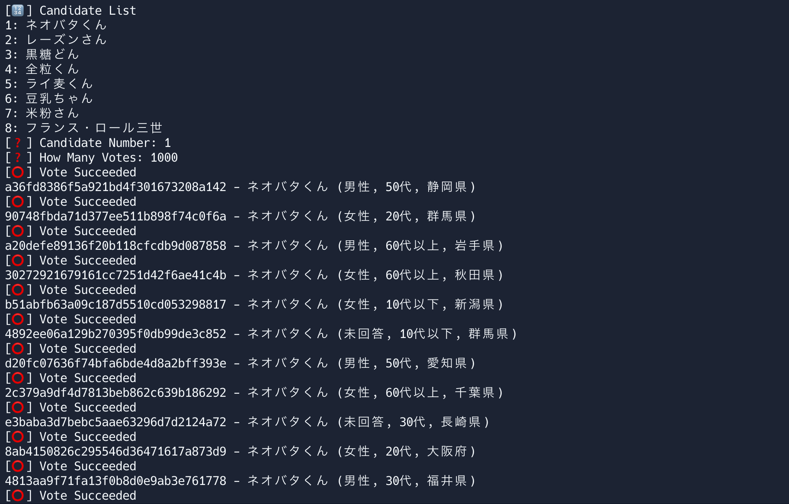

# 🗳️ ネオバタ総選挙 投票 Tool

---

## 🧰 セットアップ

リポジトリをクローン、もしくはダウンロード。

```bash
git clone https://github.com/n0vql/neobata.git
cd neobata
```

必要なパッケージのインストール。

```bash
pip install -r requirements.txt
```

---

## 🚀 使い方

```bash
python neobata.py
```

実行したら

```
[🔢] Candidate List
1: ネオバタくん
2: レーズンさん
3: 黒糖どん
4: 全粒くん
5: ライ麦くん
6: 豆乳ちゃん
7: 米粉さん
8: フランス・ロール三世
[❓] Candidate Number: 
[❓] How Many Votes: 
```

が表示される。

候補者を `1~8` の数字で選んで、次に投票回数を入力すると投票開始。<br>
レートリミットがあるから全部入るわけではない。



---

## 📝 注意事項

このスクリプトは**教育目的**で作成したので、使用は**自己責任**でね。
